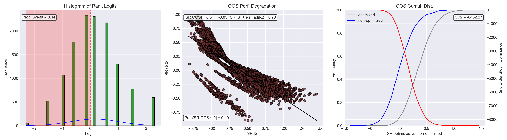

# Probability of Backtest Overfitting (PBO) Framework

A Python implementation of the Probability of Backtest Overfitting test from Bailey et al. (2015) for detecting when trading strategies are overfit to historical data.

## Overview

Backtesting is essential for strategy validation, but it comes with a critical problem: **overfitting**. When you optimize strategy parameters on historical data, you risk finding configurations that worked by chance rather than genuine edge.

The Probability of Backtest Overfitting (PBO) quantifies this risk. It measures the probability that your "best" in-sample strategy will underperform the median strategy out-of-sample. A high PBO (>0.5) indicates your strategy is likely curve-fit to noise.

This framework implements the full PBO procedure including:
- Combinatorially Symmetric Cross-Validation (CSCV) for robust train/test splitting
- Performance degradation analysis
- Stochastic dominance testing
- Comprehensive diagnostic visualizations

## Key Results

I tested the framework on a classic example: **moving average crossover strategies on SPY (2010-2024)**.

Testing 10 parameter combinations across 12,870 train/test splits revealed:



**Key Findings:**
- **PBO = 0.44** ("Questionable" - moderate overfitting)
- **Performance Degradation:** Strong negative correlation (-0.85) between in-sample and out-of-sample Sharpe ratios
- **SD2 = -8452.27:** In-sample performance stochastically dominates out-of-sample (systematic overfitting)
- **49% of strategies** lose money out-of-sample despite being "optimized"

**Interpretation:** Parameter optimization on MA crossovers is unreliable. The strategies that look best historically are systematically the worst going forward - a textbook case of overfitting.

## What I Learned

This project was a great introduction to thinking like a quant. Often times, people jump into developing algorithmic strategies and pricing tools, but reading the inspiration paper and talking to individuals helped me realize that understanding the "why" is much more important for establishing the fundamentals.

Implementing the simple Moving Average and Mean Reversion strategies were great ways to introduce algorithmic strategy production, and the results were further evidence that finding edge in markets is a challenge for everyone.

The CSCV and PBO implementations felt like high school coding all over again, working with matrices and following a set procedure. Its amazing to see simple concepts have such impactful outcomes in industry.

Overall, this project was a great first step, and I will continue applying what I learned in further quant endeavors.

## Installation

```bash
# Clone repository
git clone https://github.com/rchhabra17/probability-of-backtest-overfitting.git
cd probability-of-backtest-overfitting

# Create virtual environment
python -m venv .venv
source .venv/bin/activate  # On Windows: .venv\Scripts\activate

# Install dependencies
pip install -r requirements.txt
```

## Quick Start

### Using the Strategy Framework

```python
from strategy_framework import MovingAverageCrossover, quick_pbo_analysis
import pandas as pd

# Load your price data
prices = pd.read_csv('your_data.csv', index_col=0, parse_dates=True)

# Create strategy instance
strategy = MovingAverageCrossover()

# Run complete PBO analysis (automatically saves M matrix and metadata)
quick_pbo_analysis(strategy, prices['SPY'], S=16)

# Then run the analysis
# python run_pbo_analysis.py
```

### Creating Your Own Strategy

```python
from strategy_framework import Strategy
from typing import List, Dict, Any
import pandas as pd

class YourStrategy(Strategy):
    def get_parameter_grid(self) -> List[Dict[str, Any]]:
        """Define parameter combinations to test."""
        return [
            {'param1': 10, 'param2': 20},
            {'param1': 20, 'param2': 40},
            # ... more combinations
        ]
    
    def generate_signals(self, prices: pd.DataFrame, **params) -> pd.Series:
        """Generate trading signals based on parameters."""
        # Your strategy logic here
        # Return pd.Series of signals: 1 (long), -1 (short), 0 (neutral)
        pass

# Use it
strategy = YourStrategy()
quick_pbo_analysis(strategy, prices, S=16)
```

## Project Structure

```
├── data/                       # Data storage (gitignored)
│   ├── M_matrix.npy           # Generated P&L matrix
│   └── M_metadata.json        # Strategy metadata
├── results/                    # Analysis outputs (gitignored except examples)
│   ├── examples/              # Example results for demo
│   │   ├── pbo_diagnostics.png
│   │   └── pbo_report.txt
│   ├── analysis_result.pkl    # Detailed analysis results
│   └── pbo_result.pkl         # PBO metrics
├── data_retrieval.py          # Free data fetching (yfinance, FRED, Fama-French)
├── backtesting_engine.py      # Modular backtesting framework
├── cscv.py                    # CSCV data partitioning
├── analyze_models.py          # Performance evaluation and logit calculation
├── pbo.py                     # PBO calculation and diagnostics
├── strategy_framework.py      # Reusable strategy interface
├── run_pbo_analysis.py        # Main analysis pipeline
└── requirements.txt           # Python dependencies
```

## Usage Guide

### Step 1: Prepare Data

```python
from data_retrieval import fetch_price_data

# Fetch data (uses yfinance - free)
tickers = ['SPY', 'QQQ', 'TLT']  # Your universe
prices = fetch_price_data(tickers, '2010-01-01', '2024-12-31')
```

### Step 2: Create Strategy Variants

Either use the framework (recommended):
```python
from strategy_framework import quick_pbo_analysis, MovingAverageCrossover

strategy = MovingAverageCrossover()
quick_pbo_analysis(strategy, prices['SPY'], S=16)
```

Or manually generate M matrix (advanced):
```python
# Your custom code to generate M_matrix.npy and M_metadata.json
```

### Step 3: Run PBO Analysis

```bash
python run_pbo_analysis.py

# Or with options
python run_pbo_analysis.py --metric sortino_ratio --output-dir results/sortino/
```

### Step 4: Interpret Results

**PBO Thresholds:**
- **PBO < 0.3:** Likely robust - low overfitting risk
- **0.3 ≤ PBO < 0.5:** Questionable - moderate concerns
- **PBO ≥ 0.5:** Likely overfit - high risk of curve-fitting

**Diagnostic Plots:**
1. **Logit Histogram:** Distribution of rank consistency. Area left of zero = PBO
2. **Performance Degradation:** Relationship between IS and OOS performance. Negative slope = overfitting
3. **Stochastic Dominance:** CDF comparison. Separation between curves = magnitude of overfitting

## Technical Details

### CSCV Procedure

The Combinatorially Symmetric Cross-Validation splits your data into S submatrices and generates C(S, S/2) train/test combinations. For each combination:

1. Training set: S/2 randomly selected submatrices
2. Testing set: Remaining S/2 submatrices
3. Rank strategies by performance on each set
4. Compare ranks to detect overfitting

**Default:** S=16 generates 12,870 combinations, providing robust statistical power.

### Performance Metrics

Available metrics for ranking strategies:
- **Sharpe Ratio** (default): Return / volatility
- **Sortino Ratio:** Return / downside deviation
- **Calmar Ratio:** Return / max drawdown
- **Total Return:** Cumulative P&L

### Data Requirements

- **M matrix:** (T × N) where T = observations, N = strategy variants
- **T must be divisible by S** for clean CSCV splits
- Each column is the P&L series for one strategy configuration

## References

Bailey, D. H., Borwein, J., López de Prado, M., & Zhu, Q. J. (2015). *The Probability of Backtest Overfitting*. Journal of Computational Finance. [SSRN Link](https://papers.ssrn.com/sol3/papers.cfm?abstract_id=2326253)

---

**Questions or issues?** Open an issue or reach out at rishabh.chhabra2024@gmail.com.
